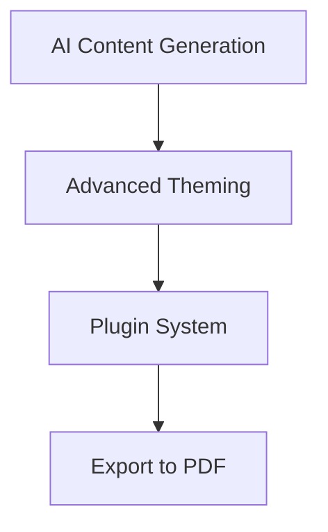

## Recent Updates

Boris Sprickut releases updates regularly to enhance your documentation experience. Check this changelog to see what's new.

<Callout kind="info">
  Subscribe to our RSS feed or join the Discord community to get notifications about new releases.
</Callout>

<Update label="2024-10-20" description="v1.3.0" tags={["feature", "improvement"]}>

## New Features

- Added support for custom brand colors in themes, allowing you to set colors like `#3B82F6` directly in your config.
- Introduced real-time collaboration previews for shared documentation spaces.

## Improvements

- Enhanced search performance by `>50%` for large documentation sites.
- Updated MDX parsing to support nested components more reliably.

</Update>

<Update label="2024-10-05" description="v1.2.0" tags={["feature", "bugfix"]}>

## New Features

- Integrated Mermaid diagram rendering with automatic syntax validation.
- Added `ParamField` and `ResponseField` components for better API documentation.

## Bug Fixes

- Fixed parsing errors with unescaped `{` and `}` characters in prose.
- Resolved issues with nested code blocks using incorrect backtick counts.

</Update>

<Update label="2024-09-15" description="v1.1.0" tags={["breaking", "feature"]}>

## Breaking Changes

- Updated JSX attribute requirements to enforce double quotes only.

## New Features

- Launched `Update` component for changelog entries with tags support.
- Added `Columns` and `Card` components for flexible layouts.

## Bug Fixes

- Corrected heading hierarchy enforcement starting from H2 only.

</Update>

## Version Summary

Get a quick overview of key changes across releases.

<Columns cols={3}>
  <Card title="Performance Boosts" icon="zap" href="#recent-updates">
    Search is now `<50ms` and components render faster.
  </Card>
  <Card title="New Components" icon="package" href="#recent-updates">
    Mermaid, Update, and API fields streamline your docs.
  </Card>
  <Card title="Developer Tools" icon="code" href="#recent-updates">
    Better parsing and collaboration features.
  </Card>
</Columns>

## Upcoming Changes

<Expandable title="Roadmap Preview" default-open="false">

Preview what's coming next to Boris Sprickut.



Stay tuned for beta access in the next release.

</Expandable>

## How to Upgrade

Follow these steps to update your Boris Sprickut instance.

<Steps>
  <Step title="Backup" icon="database">

    Create a backup of your current documentation.

    ```
    cp -r docs/ docs-backup/
    ```

  </Step>
  <Step title="Update Package" icon="download">

    <CodeGroup tabs="npm,yarn">

    ````bash
    npm install boris-sprickut@latest
    ````

    ````bash
    yarn add boris-sprickut@latest
    ````

    </CodeGroup>

  </Step>
  <Step title="Deploy Changes" icon="rocket">

    Rebuild and redeploy your site.

    ```
    npm run build
    ```

  </Step>
</Steps>

<Callout kind="tip">
  Test updates in a staging environment first. Check the migration guide for `{breaking}` changes.
</Callout>