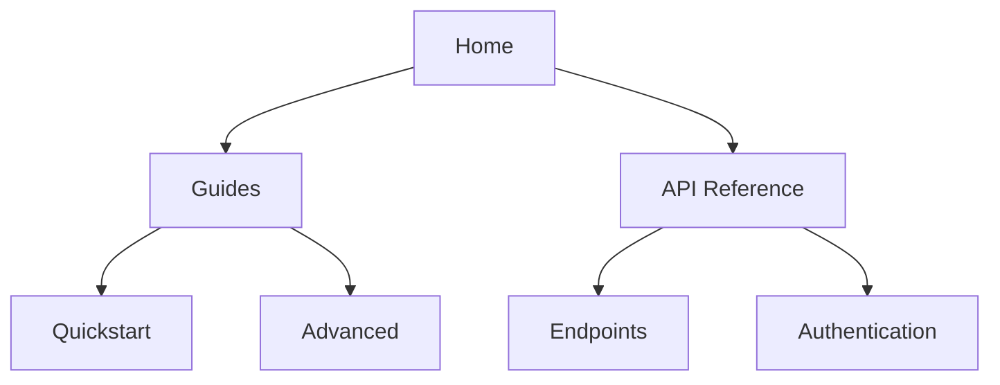

## Overview

Boris Sprickut empowers you to build structured documentation sites with ease. You organize content into hierarchies, search efficiently, track changes via version history, and customize appearances to match your brand. These core features help teams collaborate seamlessly on technical docs, guides, and API references.

## Key Features

<Columns cols={2}>
  <Card title="Document Hierarchies" icon="layers" href="#document-structuring">
    Create nested page structures for intuitive navigation.
  </Card>
  <Card title="Search & Filtering" icon="search" href="#search-filtering">
    Find content instantly with advanced search tools.
  </Card>
  <Card title="Version History" icon="git-branch" href="#version-history">
    Track and revert changes across page edits.
  </Card>
  <Card title="Customization" icon="palette" href="#customization">
    Tailor themes, layouts, and components to your needs.
  </Card>
</Columns>

## Document Structuring and Hierarchies

You define clear hierarchies using folders and frontmatter in Boris Sprickut. Start by creating a sidebar navigation that reflects your docs structure.

<Steps>
  <Step title="Create Folders" icon="folder">
    Organize pages into folders like `guides/`, `api/`, and `changelog/`.
  </Step>
  <Step title="Add Frontmatter" icon="file-text">
    Use YAML frontmatter to set titles and descriptions.
  </Step>
  <Step title="Link Pages" icon="link">
    Reference child pages with relative paths like `/guides/quickstart`.
  </Step>
</Steps>

Visualize your hierarchy:



<Callout kind="tip">
  Use anchor links like `#section` for in-page navigation within hierarchies.
</Callout>

## Search and Filtering Tools

Boris Sprickut provides powerful search across all pages. Filter by tags, dates, or content types.

<Tabs>
  <Tab title="Basic Search" icon="search">
    Enter keywords to find matching pages instantly.
  </Tab>
  <Tab title="Advanced Filters" icon="filter">
    Combine tags and dates: `tag:api since:2024-01-01`.
  </Tab>
  <Tab title="Saved Searches" icon="bookmark">
    Save frequent queries for quick access.
  </Tab>
</Tabs>

## Version History for Pages

Track every change with built-in version control. You view diffs, restore previous versions, or compare edits.

<CodeGroup tabs="CLI,UI">
  ```bash
  # View history via CLI
  boris history features.mdx
  ```
  ```javascript
  // Programmatic access
  const history = await boris.getPageHistory('features.mdx');
  console.log(history[0].changes);
  ```
</CodeGroup>

## Customization Options

Tailor Boris Sprickut to your brand. Set themes in a config file.

```yaml
# boris.config.yaml
theme:
  primaryColor: "#3B82F6"
  font: "Inter"
components:
  enabled:
    - Cards
    - Tabs
```

<Expandable title="Advanced Custom Components" default-open="false">
  Extend with custom MDX components.

  ```tsx
  // components/CustomCard.tsx
  export const CustomCard = ({ title, children }) => (
    <div className="custom-card">
      <h3>{title}</h3>
      {children}
    </div>
  );
  ```
</Expandable>

<Callout kind="success">
  Explore [quickstart](/quickstart) to set up your first project and unlock these features.
</Callout>